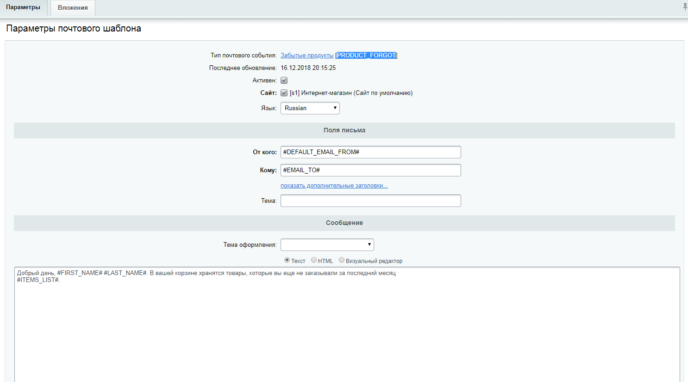
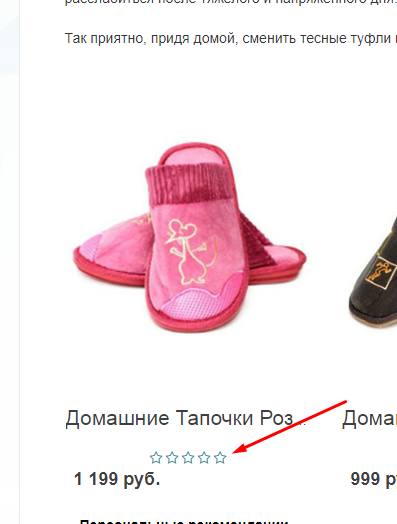
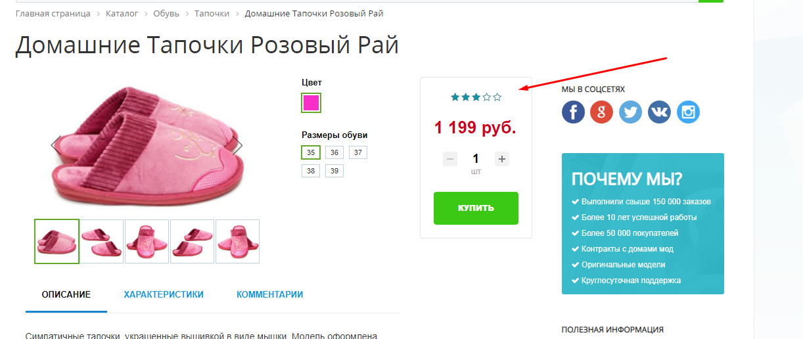

###### Чек лист
- [x] задча 1, вариант а
*Написал текстовый документ с описанием чего сделал вышло окло 8ч [см ответ](media/solution-task-one.docx)* 
- [x] задача 2, вариант а, время выполнения 2:30
- написал скрипт [cron_events.php](local/php_interface/cron_events.php)
- Текстовый шаблон, почтового события 

*Добрый день, #FIRST_NAME# #LAST_NAME#. В вашей корзине хранятся товары, которые вы еще не заказывали за последний месяц #ITEMS_LIST#.*

- ID тип почтового события 

*PRODUCT_FORGOT*

- [x] задача 3, Время 2:50
- Сервестал по бему
- интегрировал в католог 
- Указал путь к верстке рейтнга [перейти](local/templates/eshop_bootstrap_green/components/bitrix/iblock.vote)

 

# Билет 

**1. Теория. Одна задача на выбор:**

а) Дано: интернет магазин на "1с-битрикс: Бизнес", каталог, корзина и оформление заказа реализованы нативными компонентами (catalog, sale.basket.basker, sale.order.full).

Задача: реализовать акцию "Каждый N товар за X рублей". У акции должны быть настройки, где выставляется период активности акции, параметры N и X

**Пример**: при N=2 и X=1 каждый второй товар будет стоить 1 рубль. Выбираются товары с наименьшей ценой. Нужно считать каждый экземпляр товара. То есть если в корзине одного товара 5 штук, второго товара 3 штуки, то 4 товара надо продать за 1 рубль.

Еще один **пример**. В корзине:

товар 1, цена 500 рублей, 3 штуки

товар 2, цена 100 рублей, 2 штуки

товар 3, цена 200 рублей, 4 штуки

Акция: каждый 3-й товар за 1 рубль. У нас 9 предметов, значит 3 из них надо продать по рублю. Берем 3 самых дешевых предмета. Итого мы продаем товар 1 по своей цене, товар 2 продаем по рублю, у товара 3 продаем один предмет по рублю, три предмента по своей цене. Получилось 3 самых дешевых предмета по рублю, остальные по своей цене.

б) Дано: интернет магазин на "1с-битрикс: Бизнес", каталог, корзина и оформление заказа реализованы нативными компонентами (catalog, sale.basket.basket, sale.order.full).

Задача: реализовать бонусный счет пользователя, на который начисляются средства за каждый оплаченный заказ в размере X процентов от стоимости товаров в заказе. Покупатель может оплатить часть следующих заказов со своего бонусного счете в размере Y процентов от стоимости товаров. У данной программы лояльности должны быть настройки, где выставляется процент, начисляемый с заказа, а также максимальный процент, который можно оплатить с бонусного счета.

**2. Практика. Одна задача на выбор:**

а) У пользователя есть отложенные товары в корзине. Необходимо сделать почтовую рассылку по пользователям "Добрый день, #Имя_Фамилия# В вашем вишлисте хранятся товары #список_товаров#.", в списке указать все товары, отложенные за последние тридцать дней. При этом нужно проверить, чтобы в список не попали изделия, которые присутствуют в заказах пользователя за последний месяц. Скрипт должен быть оформлен для выполнения из консоли по крону. Пошаговое выполнение приветствуется, но необязательно.

б) Компонент news.list выводит элементы из инфоблока "Статьи". У элементов инфоблока есть множественное свойство типа "Привязка к пользователю" под названием "Пользователи, которым понравилась статья". Необходимо доработать стандартный шаблон компонента следующим образом: выводить логины пользователей, которым понравилась статья. Если пользователь авторизован, и он поставил "лайк" статье, то выводить ссылку "Уже не нравится", если он не ставил "лайк", то выводить ссылку "Мне нравится статья". У компонента должно работать управляемое кэширование, не зависящее от ID пользователя. На выходе – папка с доработанным шаблоном и аякс-обработчик "лайка".

**3. Практика. Фронтенд**

Сверстай контрол оценки и показа рейтинга. Практически все наши контролы должны быть очень гибкими к окружающему пространству, должны уметь располагаться на любом фоне и при желании легко менять свой "скин". Обрати внимание, что контрол должен не только выставлять оценку, но и показывать текущую.

Плюсом будет верстка по БЭМу.
